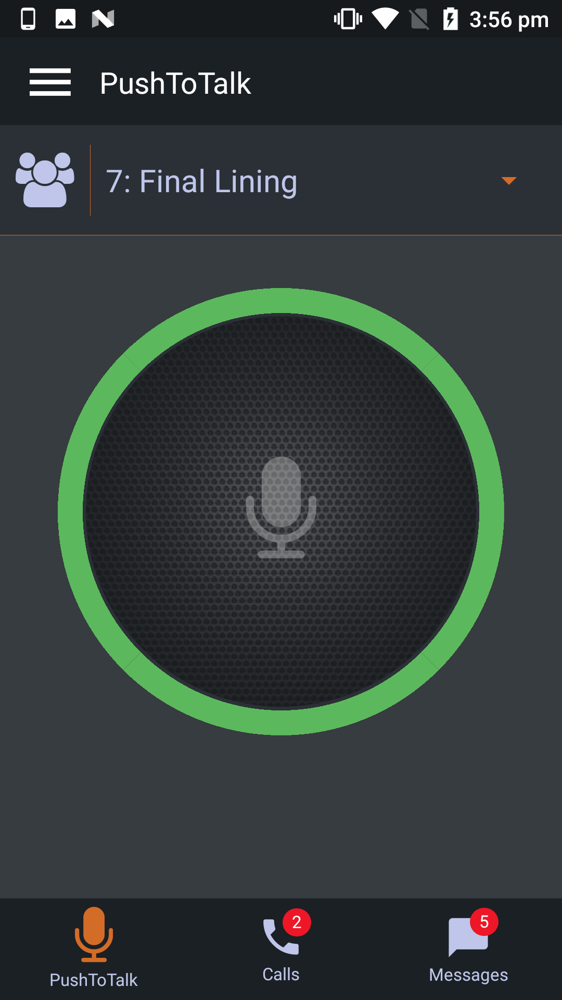
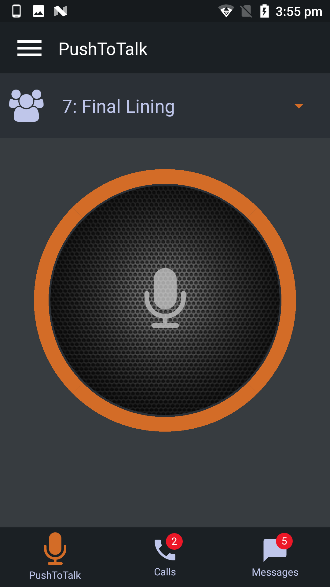
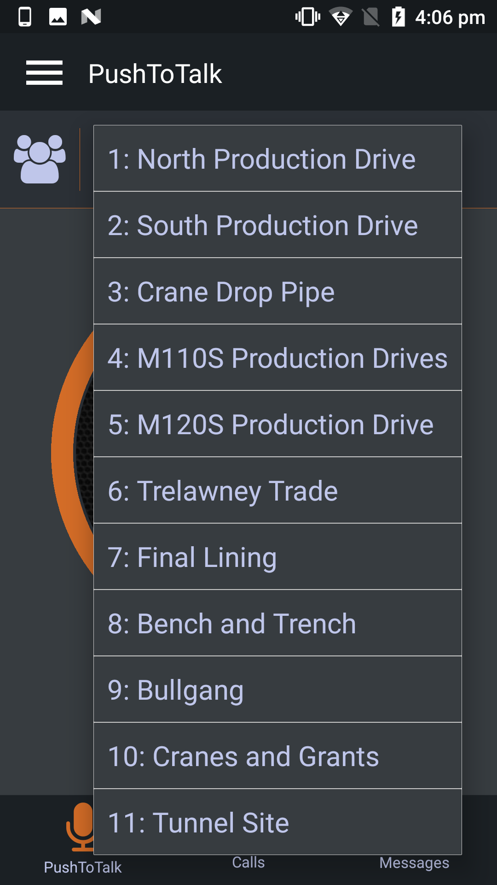
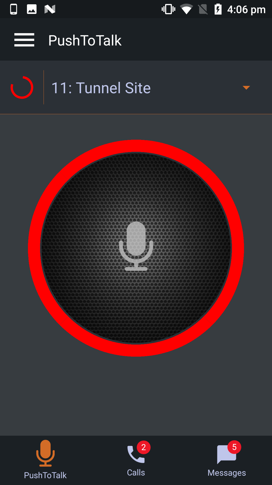
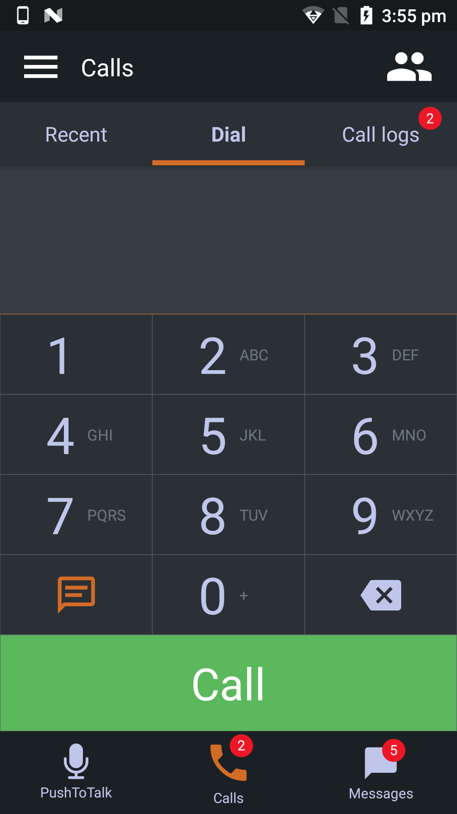
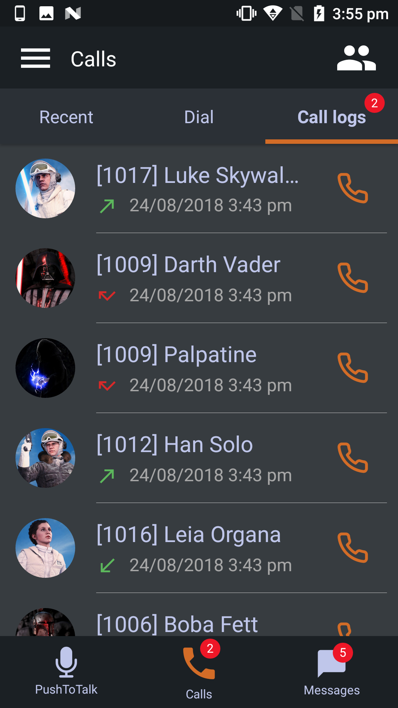
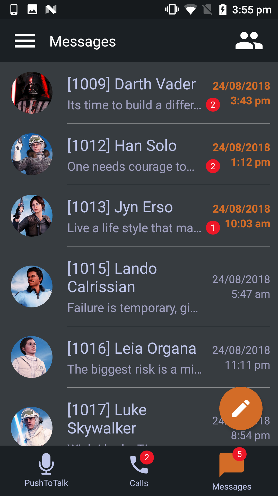
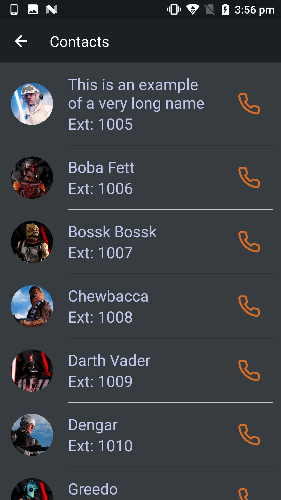
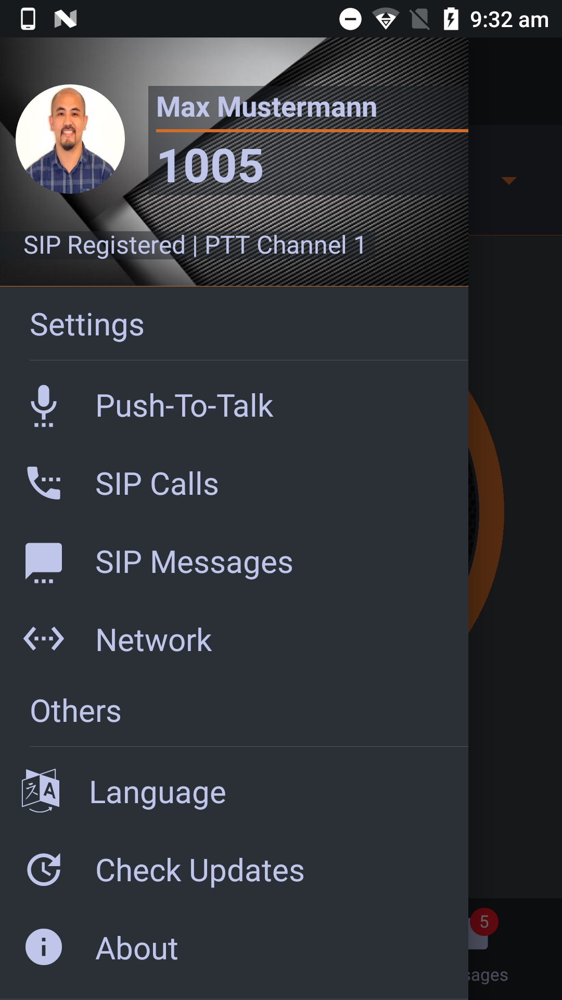

A Push-To-Talk and SIP Call/Messaging UI implemented in React Native.

# Installation
```
npm install
npm start
```
# Sreenshots
Hight resolution screenshots can be found in screenshots folder.

          
